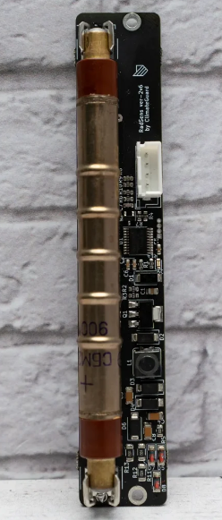

# RadSens-python-library
It is a full merge from C++ to Python of a library for the RadSens of Climate Guard. This is in order to usit from a raspberry pi zero.

Official library at: https://github.com/climateguard/RadSens

